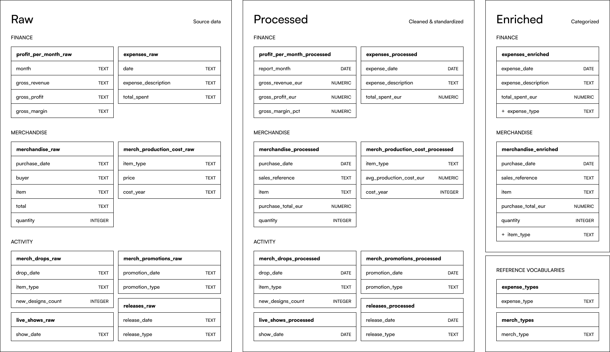
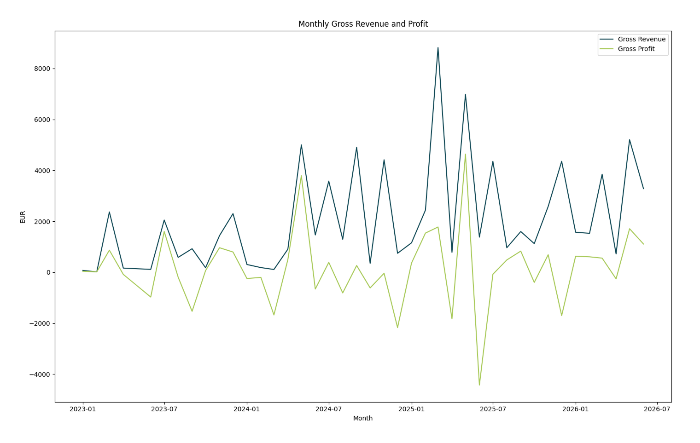
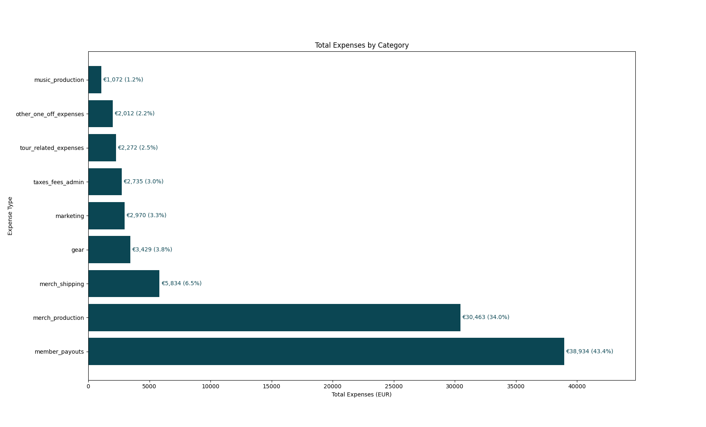
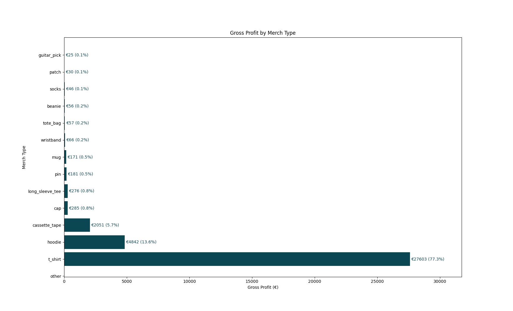
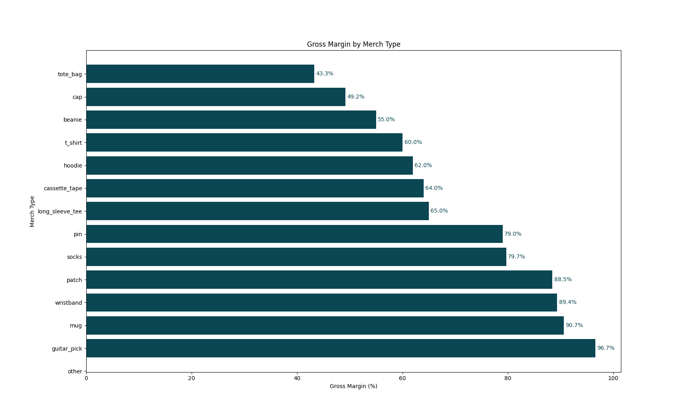
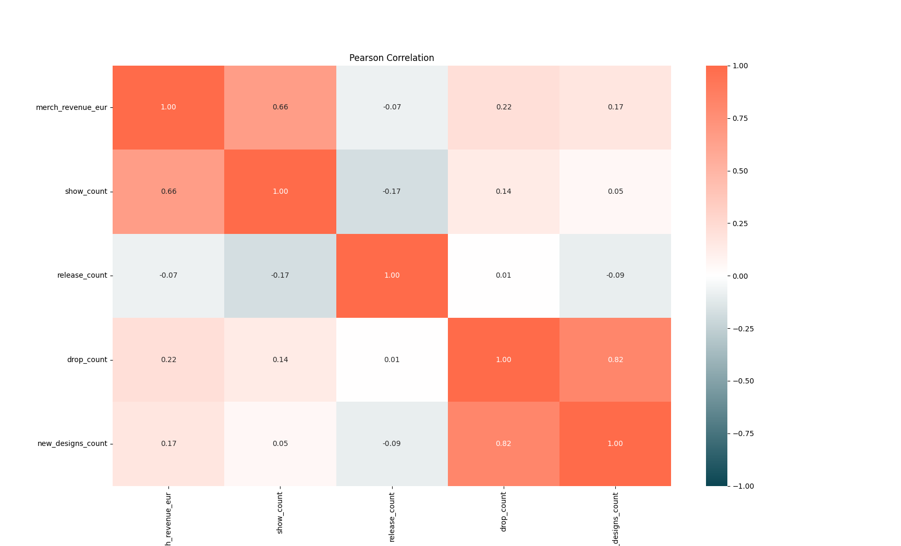
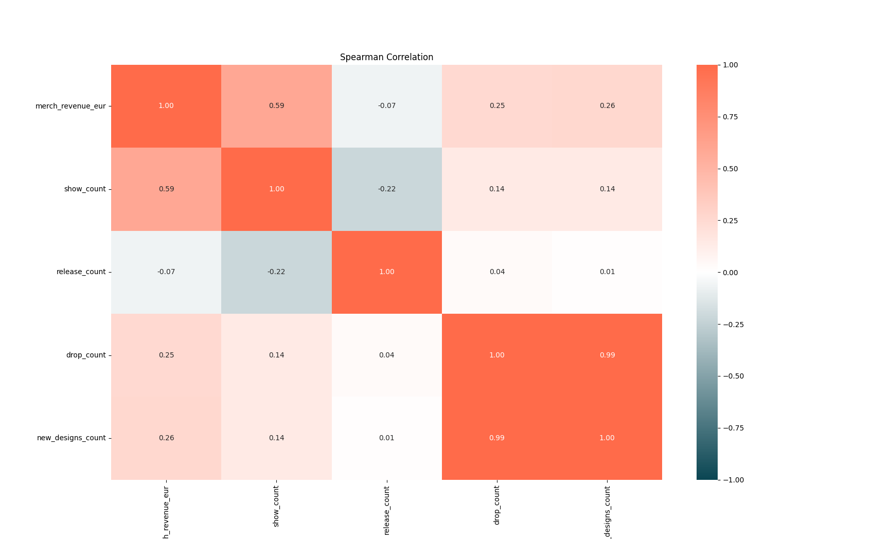
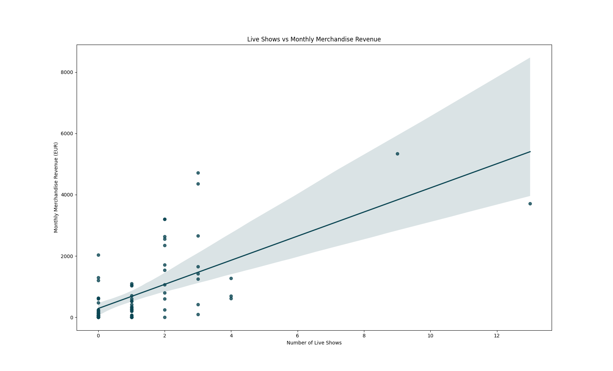
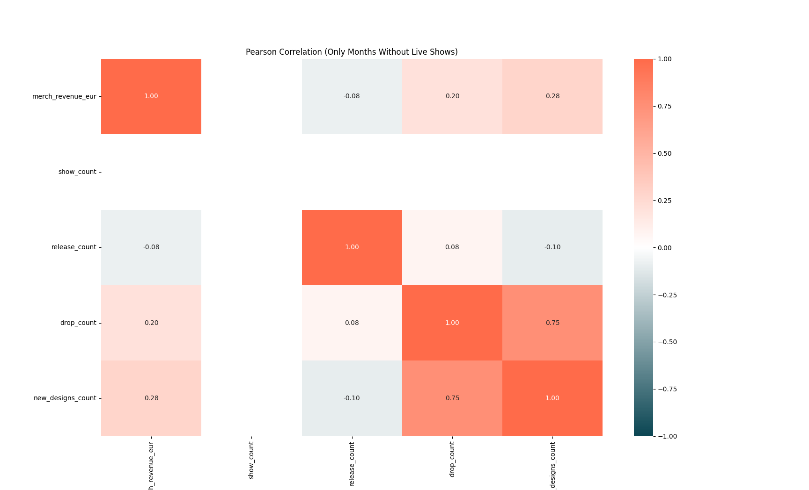
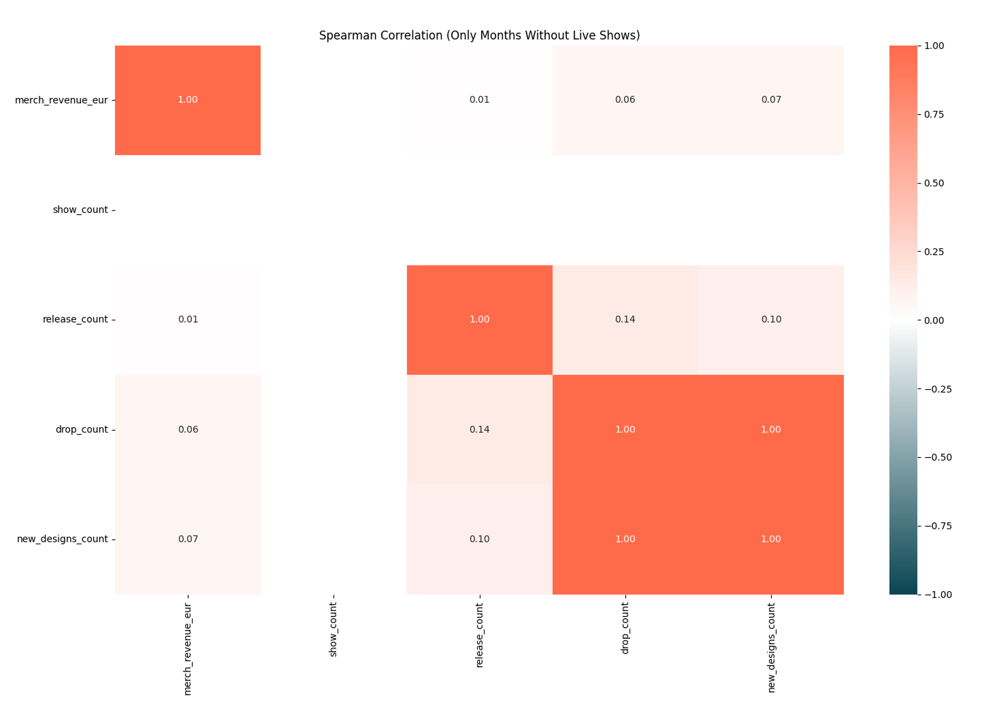

# Business Analytics for a Professional Music Band

An end-to-end analysis of financial performance, merchandise profitability & sales drivers using Excel, PostgreSQL, SQL, and Python.

## Quick Navigation

- [Context](#context)
- [Key Questions](#key-questions)
- [From Raw Records to Analysis-Ready Data](#from-raw-records-to-analysis-ready-data)
- [Analysis & Findings](#analysis--findings)
  - [Financial Performance](#financial-performance-improved-through-2025-but-profitability-remained-volatile)
  - [Spending Breakdown](#spending-breakdown)
  - [Merchandise Performance](#merchandise-performance)
  - [Merchandise Sales Drivers](#what-drives-merchandise-sales)
- [Recommendations & Limitations](#recommendations--limitations)
- [Tech Stack](#tech-stack)
  
## Context

The client is a professional band with several years of financial and operational data.

The records had been maintained manually in Google Sheets and Excel for day-to-day operations. After several years, the data was spread across separate tables with inconsistent names, free-text descriptions, and mixed formats — enough for everyday purposes, but difficult to analyze.

The project had two goals:

1. To turn existing records into reliable analysis-ready data.
2. To use that data to better understand the economics of the band and support future decisions.

## Key Questions

1. How has the band's financial performance developed over time?
2. Where does the money go and are there any ways to cut costs?
3. Which merchandise categories generate the most value?
4. What is associated with stronger merchandise sales — live shows, music releases, merchandise drops, or the number of new designs in a merch drop?
5. Can merchandise prices be increased as production costs rise without seriously reducing demand?

\* The final question could not yet be answered reliably with the available data. This is discussed in **Recommendations & Limitations**.

## From Raw Records to Analysis-Ready Data

Data preparation was a major part of the project. The original records had been accumulated over several years and were useful operationally, but were not consistent enough for analysis.

To sort this, I created a reusable processing workflow.

### Cleaning & standardization (Python)

- Converted blank cells and whitespace-only cells into consistent missing values.
- In money columns, removed currency symbols, standardized formatting, and converted monetary values into numeric types.
- Normalized capitalization and whitespace in text fields.
- Renamed columns with non-descriptive names.
- Standardized merchandise naming.
- Pseudonymized buyer identifiers.
- Wrote the resulting processed tables back to PostgreSQL as new tables.

### Categorization & enrichment (Python)

Expense and merchandise records were grouped into consistent analytical categories using reproducible, rule-based logic. The same workflow can be applied to future entries.

### Data quality checks and corrections (SQL)

After writing cleaned and enriched data to PostgreSQL, I checked the data to detect:

- missing required tables or columns,
- unexpected database types,
- NULLs in required analytical fields,
- duplicate months and duplicate category/year combinations,
- merchandise sales without matching production-cost records,
- missing production costs,
- impossible values such as negative revenue or quantities.

These checks revealed errors in the records, which I corrected before analysis.

### Data schema

### Data privacy

The original data contain customer information and cannot be shown publicly. Customer identifiers were pseudonymized before analysis, and confidential source data are not included in the public repository.

## Analysis & Findings

### Financial performance improved through 2025, but profitability remained volatile

The financial dataset contains approximately **€86.2k in recorded gross revenue across 41 monthly records**, covering January 2023 through June 2026.

Revenue increased from 2023 to 2025, with **2025 being the strongest complete year** in the current dataset. Gross profit also improved over this period, but monthly results remained volatile: strong profitable months were mixed with periods in which expenses exceeded revenue. Gross margin fluctuated considerably as well, showing that higher revenue did not always translate into equally strong profitability.

#### 2025 as a monthly performance benchmark

2025 was the strongest complete year in the dataset, making it a useful reference point for future monthly performance.

Because monthly results are highly uneven, **medians are used as the primary benchmark rather than means**. Unusually strong and weak months can pull the mean away from what a typical month looks like, while the median is less sensitive to such extremes.

|  | Typical month — median | Strong month — 75th percentile |
| --- | ---: | ---: |
| **Gross revenue** | €2,019.50 | €4,353.68 |
| **Gross profit** | €1,124.34 | €2,095.93 |
| **Gross margin** | 52.18% | 79.83% |

The median provides a realistic reference for a typical month, while the 75th percentile shows the level reached in the stronger quarter of monthly results. These are historical benchmarks rather than fixed targets.

### Spending Breakdown

Two categories dominate the cost structure:

- **Member payouts:** ~43% of recorded expenses
- **Merchandise production:** ~34%

Merchandise production and shipping together account for approximately **40% of total recorded expenditure**, making merchandise economics particularly important.

*Most spending is concentrated in a small number of categories.*

### Merchandise Performance

The merchandise dataset contains approximately **€65.4k in recorded sales revenue across 866 transaction rows**.

Revenue is highly concentrated by product category:

- **T-shirts:** ~€46.0k — approximately **70% of all recorded merchandise revenue**
- **Hoodies:** ~€7.8k
- **Vinyl:** ~€4.5k
- **Cassette tapes:** ~€3.2k

Revenue alone, however, does not tell us which products are economically strongest. Merchandise profitability was therefore estimated by combining annual quantities sold with the average production cost for each product type and year.

Two complementary measures were used:

**Gross profit** shows which categories contribute the most money in absolute terms.

**Gross margin** shows how efficiently revenue turns into profit.

This distinction matters because products with very high percentage margins do not necessarily make a large contribution to total profit if volumes are small.

T-shirts make by far the largest absolute contribution to merchandise gross profit, while several lower-volume products achieve higher percentage margins. Product decisions therefore need to consider both **volume and margin**, rather than either metric alone.

### What Drives Merchandise Sales?

Because merchandise is the band's main source of revenue, one of the most important questions was whether recurring band activities were associated with stronger merchandise sales.

Four potential drivers were examined:

- number of live shows,
- number of music releases,
- number of merchandise drops,
- number of new merchandise designs in a drop.

Merchandise transactions were aggregated by month and combined with monthly activity data. Months with no recorded merchandise sales were retained and assigned zero revenue rather than being dropped from the analysis.

#### Live shows stand out

Live shows produced by far the strongest and most consistent relationship with merchandise revenue:

- **Pearson r ≈ 0.66**
- **Spearman ρ ≈ 0.59**

Months with at least one live show generated a median of approximately **€598 in merchandise revenue**, compared with approximately **€98 in months without a live show**.

**Live-show frequency shows the strongest observed relationship with monthly merchandise revenue.**

#### Releases show no meaningful same-month relationship

The number of music releases showed virtually no relationship with monthly merchandise revenue:

- **Pearson ≈ −0.07**
- **Spearman ≈ −0.07**

This does not mean releases have no commercial value. They may affect streaming revenue, audience growth, bookings, long-term fan engagement, or merchandise sales after a delay.

It only means that the available historical data do not show a meaningful **same-month relationship between releases and merchandise revenue**.

#### Merch drops and new designs show weaker evidence

Merchandise drops and the number of new designs showed considerably weaker relationships with monthly merchandise revenue than live shows.

The historical data therefore do not provide strong evidence that simply increasing drop frequency or the number of new designs reliably increases monthly merchandise revenue.

<strong>Robustness check: excluding months with live shows</strong>

Because live shows had the strongest relationship with merchandise revenue, I repeated the analysis using only months without shows. I wanted to see whether the other factors became more visible once the live-show effect was removed.

They did not. **Releases still showed almost no relationship with merchandise revenue.** Merch drops showed a weak positive Pearson correlation, but Spearman did not support the same pattern.

So there is still no consistent evidence that more merch drops or more new designs lead to higher monthly merchandise revenue.

<strong>Methodology & additional robustness notes</strong>

Monthly merchandise sales are highly uneven and include a small number of very strong sales periods.

I therefore compared two correlation measures:

- **Pearson correlation**, which measures linear association and is more sensitive to extreme observations;
- **Spearman correlation**, which is based on ranks and is less dependent on a linear relationship.

If a relationship appears under both measures, there is more confidence that it is not simply the product of one or two unusually strong months.

A release or merchandise drop occurring near the end of a month could also influence sales in the following month rather than the month in which it occurred.

I explored an event-window approach using daily merchandise revenue around release dates, but the available history does not provide sufficiently clean comparison periods: releases, live shows, seasonality, and other events can overlap, while the number of events is relatively small.

For that reason, the analysis stops at what the available data can support reliably.

## Recommendations & Limitations

### What the data supports

#### 1. Treat live shows as the strongest merchandise-sales opportunity

Live shows show the strongest observed association with merchandise revenue.

This does not mean shows should be booked solely to generate merchandise sales: concerts have their own costs, and the analysis shows association rather than causation.

However, when shows are already planned, treat them as priority merchandise-sales opportunities.

#### 2. Do not rely on more releases or more merch drops as revenue-growth strategies

The data do not show a meaningful same-month merchandise lift from releases.

Likewise, the relationship between merchandise drops and merchandise revenue is much weaker and less consistent than the live-show relationship.

Releases and merch drops may still be valuable for other reasons, but the data does not support increasing their frequency as a standalone sales-growth strategy.

#### 3. Evaluate merchandise using both volume and margin

The highest-margin product is not automatically the most valuable product.

Future decisions about merchandise should consider:

- revenue contribution,
- production costs,
- gross profit and gross margin,
- demand and value to the fan community.

#### 4. Use 2025 monthly performance as a planning benchmark

Use the **2025 median monthly revenue, gross profit, and gross margin** as reference points for typical monthly performance, with the 75th percentile providing an additional benchmark for stronger months.

Revenue should not be evaluated in isolation: stronger future performance should ideally maintain or improve **revenue, profit, and margin together**.

### What the data cannot tell us yet

#### Price elasticity

Production costs are rising, creating a practical question:

**Which merchandise prices can be increased without causing a substantial drop in units sold?**

This is especially important for the band because maximizing revenue is not the only objective. Keeping merchandise affordable to the fan community is also a priority.

The current data do not contain enough historical price variation to estimate price elasticity reliably.

#### Other limitations

- The data are observational, so correlations should not be interpreted as proof of causation.
- Several activities can occur during the same period, making individual effects difficult to isolate.
- Monthly aggregation may hide delayed effects.
- Historical promotion data are too limited for meaningful statistical analysis.
- The datasets cover different time periods.
- The monthly financial dataset contains one missing month.

## Tech Stack

**Excel, Google Sheets**  
Original business records and source-data review.

**PostgreSQL**  
Storage for the datasets.

**SQL**  
Data-quality validation and corrections.

**Python**  
Data-processing and analytical workflow:

- **pandas:** cleaning, transformation, categorization, joins, and aggregation
- **Matplotlib:** financial and merchandise visualizations
- **Seaborn:** correlation heatmaps and relationship plots
- **SQLAlchemy:** reading from and writing to PostgreSQL from Python
- **python-dotenv:** environment-based database configuration
